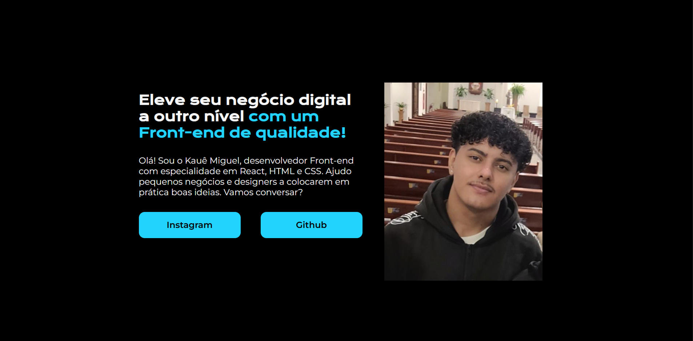

# Projeto Portfólio

Projeto desenvolvido durante os estudos de HTML e CSS na Alura.

---

## 🌐 Acesse o projeto

(https://kawem.github.io/Projeto_Portfolio_Alura/)

---

## 🖥️ Preview

---

## Objetivo

Praticar conceitos de estruturação, estilização e posicionamento de elementos utilizando HTML e CSS.